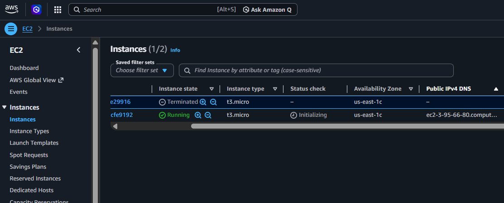

# ✦ Inkwell — A Minimal Blog App

> A lightweight, elegant blog application built with pure HTML, CSS, and JavaScript. Write, publish, and manage your thoughts — all in the browser. Containerized with Docker and deployed to AWS EC2 via a fully automated Jenkins CI/CD pipeline.

---

##  Live Demo

**Public URL:** [http://ec2-3-95-66-80.compute-1.amazonaws.com](http://ec2-3-95-66-80.compute-1.amazonaws.com)

---

##  Features

-  Write and publish blog posts with a title and content
-  Delete posts with a confirmation modal
-  Character counter on the content field
-  Keyboard shortcut: `Ctrl+Enter` to publish
-  Clean editorial design with Playfair Display typography
-  Fully responsive layout

---

##  Tech Stack

| Layer | Technology |
|-------|-----------|
| Frontend | HTML5, CSS3, Vanilla JavaScript |
| Web Server | NGINX (Alpine) |
| Containerization | Docker |
| CI/CD | Jenkins |
| Cloud Deployment | AWS EC2 (t3.micro) |

---

##  Docker Setup

The app is containerized using a minimal NGINX-based Docker image.

### Dockerfile
```dockerfile
FROM nginx:alpine
COPY index.html /usr/share/nginx/html/
COPY style.css  /usr/share/nginx/html/
COPY script.js  /usr/share/nginx/html/
EXPOSE 80
```

### Run Locally
```bash
# Build the image
docker build -t inkwell-blog ./task-manager

# Run the container
docker run -d -p 8080:80 --name inkwell inkwell-blog
```

Then visit: `http://localhost:8080`

---

##  CI/CD Pipeline (Jenkins)

The project uses a `Jenkinsfile` to fully automate the deployment lifecycle — from source code to a running container on AWS EC2.

### Pipeline Stages

```
Checkout SCM → Checkout → Build Docker Image → Health Validation → Push to Registry → Deploy to AWS EC2
```

| Stage | Description |
|-------|-------------|
| **Checkout SCM** | Jenkins clones the latest code from GitHub |
| **Checkout** | Re-verifies the working directory |
| **Build Docker Image** | Builds the Docker image tagged with build number and `latest` |
| **Health Validation** | Runs the container, hits it with `curl`, confirms it returns HTTP 200 |
| **Push to Registry** | Pushes the verified image to Docker Hub |
| **Deploy to AWS EC2** | SSHs into EC2, pulls the new image, replaces the old container |

###  Successful Pipeline Run

All 6 stages passing — Build #7 completed in 50 seconds:


---

##  AWS EC2 Deployment

The app runs on an AWS EC2 `t3.micro` instance in `us-east-1`. The Jenkins pipeline SSHs into the instance and hot-swaps the running container with the latest image — zero manual steps required.



**Instance Details:**
- **Region:** us-east-1c
- **Type:** t3.micro
- **Public DNS:** `ec2-3-95-66-80.compute-1.amazonaws.com`
- **Status:**  Running

---

##  Jenkins Credentials Required

Before running the pipeline, set up these credentials in Jenkins (`Manage Jenkins → Credentials`):

| ID | Type | Purpose |
|----|------|---------|
| `dockerhub-creds` | Username with password | Push image to Docker Hub |
| `ec2-ssh-key` | SSH Username with private key | SSH into EC2 for deployment |

---

##  Project Structure

```
Jenkins_Sample_Project/
├── task-manager/
│   ├── index.html       # Blog app HTML
│   ├── style.css        # Inkwell stylesheet
│   ├── script.js        # Blog logic
│   ├── Dockerfile       # NGINX container config
│   └── Jenkinsfile      # CI/CD pipeline definition
├── docs/
│   ├── jenkins-pipeline.png
│   └── aws-ec2.png
└── README.md
```

---

##  How to Reproduce This Setup

1. Fork this repo and push to your GitHub
2. Launch an AWS EC2 instance (Ubuntu 22.04, t3.micro) with port 80 and 22 open
3. Install Docker on EC2
4. Run Jenkins in Docker locally with the Docker socket mounted
5. Add `dockerhub-creds` and `ec2-ssh-key` credentials in Jenkins
6. Create a Pipeline job pointing to this repo with `task-manager/Jenkinsfile`
7. Click **Build Now** — your app deploys automatically 
